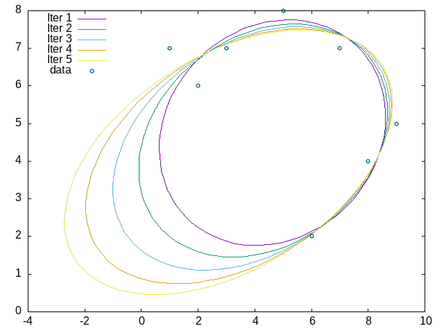

# Curve_Fit

[](https://github.com/reznikmm/curve_fit/actions/workflows/alire.yml)
[](https://alire.ada.dev/crates/curve_fit.html)
[](https://api.reuse.software/info/github.com/reznikmm/curve_fit)

> Least squares fitting of quadratic curves and surfaces.

This repository provides an Ada library for fitting quadratic curves and
surfaces to data points using the least squares method described in the paper
"Least squares fitting of quadratic curves and surfaces" by N. Chernov and H. Ma.

Currently only ellipse fitting is implemented.



## Installation

Use Alire to install and compile the library:

```bash
alr with curve_fit --use https://github.com/reznikmm/curve_fit
```

## Usage

```ada
with Ada.Text_IO;
with Curve_Fit.Ellipse;

procedure Main is
   Points : constant Curve_Fit.Ellipse.Vector_List :=
     ((1.0, 7.0),
      (2.0, 6.0),
      (5.0, 8.0),
      (7.0, 7.0),
      (9.0, 5.0),
      (3.0, 7.0),
      (6.0, 2.0),
      (8.0, 4.0));

   Result : Curve_Fit.Ellipse.Parameters;
   RSS    : Float;
begin
   Curve_Fit.Ellipse.Ellipse_Fit
     (Result  => Result,
      RSS     => RSS,
      Points  => Points,
      Initial => (2.0, 3.0, 0.3, 6.0, 3.0),
      Epsilon => 0.000_01);
   
   Ada.Text_IO.Put_Line (Result'Image);
end Main;
```
