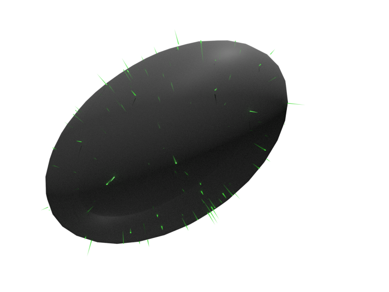

# Conic_Fit

[](https://github.com/reznikmm/conic_fit/actions/workflows/alire.yml)
[](https://alire.ada.dev/crates/conic_fit.html)
[](https://api.reuse.software/info/github.com/reznikmm/conic_fit)

> Least squares fitting of quadratic curves and surfaces.

This repository provides an Ada library for fitting quadratic curves and
surfaces to data points using the least squares method described in the paper
"Least squares fitting of quadratic curves and surfaces" by N. Chernov and H. Ma.

Currently only we implemented :
### Ellipse fitting:


### Ellipsoid fitting:


### Sphere fitting

Demo TBD

## Installation

Use Alire to install and compile the library:

```bash
alr with conic_fit --use https://github.com/reznikmm/conic_fit
```

## Usage

```ada
with Ada.Text_IO;
with Conic_Fit.Ellipse;

procedure Main is
   Points : constant Conic_Fit.Ellipse.Vector_List :=
     ((1.0, 7.0),
      (2.0, 6.0),
      (5.0, 8.0),
      (7.0, 7.0),
      (9.0, 5.0),
      (3.0, 7.0),
      (6.0, 2.0),
      (8.0, 4.0));

   Result : Conic_Fit.Ellipse.Parameters;
   RSS    : Float;  --  Residuals square sum
begin
   Conic_Fit.Ellipse.Ellipse_Fit
     (Result  => Result,
      RSS     => RSS,
      Points  => Points,
      Initial => (2.0, 3.0, 0.3, 6.0, 3.0),
      Epsilon => 0.000_01);

   Ada.Text_IO.Put_Line (Result'Image);
end Main;
```
